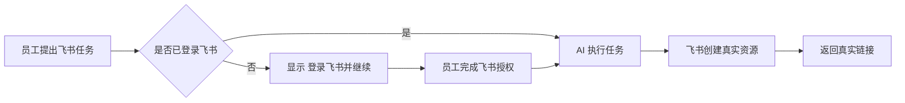
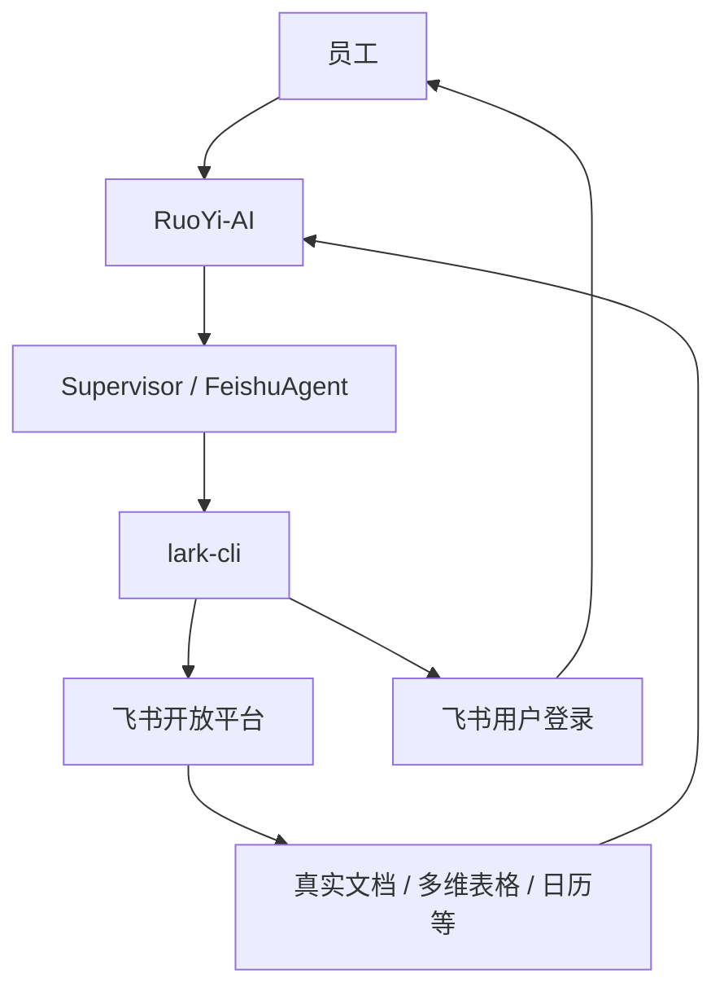

## 1. 我们正在做什么

我们正在把飞书能力接入 RuoYi-AI。

最终员工可以直接说：

> “帮我创建一个项目任务多维表格，字段包括任务名称、负责人、截止日期和状态。”

系统自动完成：

1. 判断这是飞书任务
2. 检查员工是否已授权飞书
3. 未授权时直接显示“登录飞书并继续”
4. 员工完成飞书授权
5. 系统自动继续原任务
6. 调用飞书真正创建资源
7. 返回真实飞书链接

员工不需要学习 API，也不需要重新输入任务。

## 2. 用户最终体验



例如员工说：

```text
帮我创建一个飞书多维表格：
项目任务看板，
字段包括任务名称、负责人、截止日期、状态。
```

如果尚未登录：

```text
🔐 当前操作需要你的飞书身份。

[登录飞书并继续]

授权完成后会自动继续刚才的操作，
不需要重新输入。
```

授权后：

```text
✅ 飞书授权成功
正在继续创建「项目任务看板」……
```

最终：

```text
✅ 创建成功
项目任务看板
https://真实飞书地址/...
```

## 3. 核心设计原则

我们最终选择的方案不是“自己再做一套飞书登录系统”，而是：

> **让飞书官方 lark-cli 统一负责用户登录、Token、权限和飞书 API。**

RuoYi-AI 负责：

- AI 对话
- 任务识别
- 多 Agent 调度
- 用户与租户隔离
- 授权期间暂停任务
- 授权后自动恢复
- 前端交互

lark-cli 负责：

- 飞书用户登录
- Access Token
- Token 刷新
- 权限 Scope
- 飞书 OpenAPI
- 返回真实资源结果

这样可以避免我们自己长期维护一套复杂的 OAuth 和 Token 系统。

## 4. 当前技术架构



## 5. 为什么这种方式更可靠

### 身份只有一个来源

员工是谁，由 lark-cli 的飞书登录身份决定。

我们不在自己的数据库里再复制保存一套飞书用户 Token。

这可以避免：

- 两套登录态不一致
- Token 过期不同步
- Refresh Token 维护复杂
- 自研 OAuth 的长期维护成本

## 6. 多租户和多用户隔离

每个：

```text
租户 + 用户
```

都有独立的 lark-cli 用户空间。

```text
租户 A
├── 张三 → 张三自己的飞书登录态
└── 李四 → 李四自己的飞书登录态

租户 B
└── 王五 → 王五自己的飞书登录态
```

目录结构如下
```
/data/ruoyi/lark-cli-users/
└── tenantId/
    └── userId/
        ├── config.json
        └── .data/
            └── lark-cli/
                ├── master.key
                └── *.enc

config 和用户 token 都跟 tenantId/userId 一起隔离、持久化。
```
不会出现“张三请求创建文档，实际用了李四账号”的问题。


```text
用户：帮我创建一个飞书多维表格：项目任务看板
  ↓
Supervisor → FeishuAgent → run_lark_cli
  ↓
lark-cli auth status --json --verify
  ├─ 已登录 → 执行业务命令
  └─ 未登录
       ↓
lark-cli auth login --domain base --recommend --no-wait --json
       ↓
verification_url + device_code
       ↓
聊天显示：[登录飞书并继续]
       ↓
用户打开 verification_url 并授权
       ↓
后台执行 lark-cli auth login --device-code xxx --json
       ↓
lark-cli 自己保存/刷新用户 token
       ↓
前端检测 AUTHORIZED
       ↓
POST /feishu/lark-cli/auth/resume/{resumeToken}
       ↓
恢复原 Agent 请求并继续创建多维表格
```